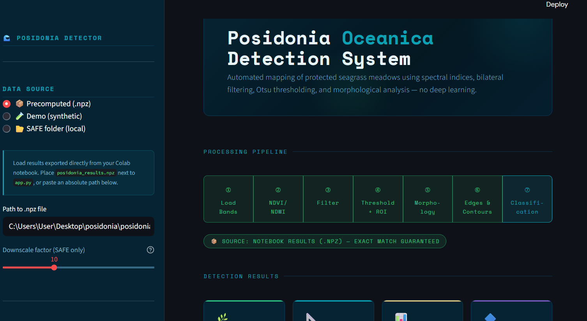
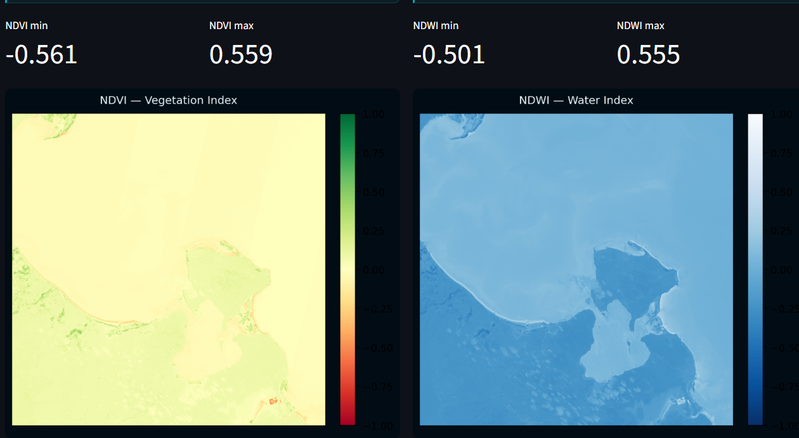
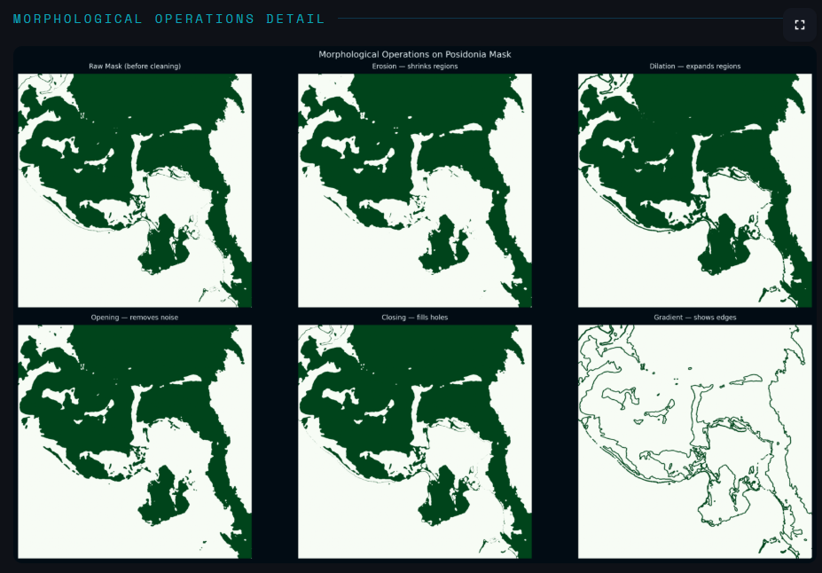
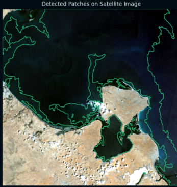

# 🌊 Posidonia Oceanica Detection System

Detection and mapping of Posidonia Oceanica seagrass meadows from Sentinel-2 satellite imagery using spectral indices, image processing, and an interactive Streamlit dashboard.



## 📌 Project Overview

Posidonia Oceanica is one of the most important marine ecosystems in the Mediterranean Sea. Monitoring its distribution is essential for biodiversity conservation and environmental management.

This project uses Sentinel-2 multispectral imagery and classical Computer Vision techniques to automatically detect Posidonia meadows without relying on deep learning models.

The system provides an interactive Streamlit dashboard for visualization, analysis, and classification of satellite data.

---

## 🚀 Features

- Sentinel-2 satellite image processing
- NDVI vegetation analysis
- NDWI water detection
- Bilateral filtering for noise reduction
- Otsu thresholding for segmentation
- Morphological operations for mask refinement
- Contour extraction and patch analysis
- Environmental classification mapping
- Interactive Streamlit dashboard

---

## 🛰️ Input Data

The system uses Sentinel-2 Level-2A imagery and processes the following spectral bands:

| Band | Description |
|--------|------------|
| B02 | Blue |
| B03 | Green |
| B04 | Red |
| B08 | Near Infrared (NIR) |

---

## 📊 Methodology

### 1. Spectral Indices
### NDVI

**Formula:**

`(NIR - Red) / (NIR + Red)`

Used for vegetation detection.

### NDWI

**Formula:**

`(Green - NIR) / (Green + NIR)`

Used to separate water from non-water areas.
---

### 2. Image Filtering

Three filtering approaches were evaluated:

- Gaussian Filter
- Median Filter
- Bilateral Filter

Bilateral filtering was selected because it preserves important boundaries while reducing noise.

---

### 3. Region of Interest Extraction

The workflow includes:

- Water mask generation
- Deep-water extraction
- Shallow-water segmentation
- Vegetation candidate selection

---

### 4. Morphological Processing

The following operations are applied:

- Erosion
- Dilation
- Opening
- Closing

These operations improve segmentation quality and remove small artifacts.

---

### 5. Contour Analysis

Detected regions are analyzed using:

- Area
- Perimeter
- Circularity
- Shape descriptors

Small noisy detections are removed automatically.

---

### 6. Final Classification

The final classification map contains four classes:

| Class | Description |
|---------|-------------|
| 🌿 | Posidonia Oceanica |
| 🌊 | Water |
| 🟨 | Sand / Bare Area |
| ⛰️ | Land / Other |

---

## 🖼️ Results

### NDVI Analysis



### Morphological Processing



### Final Classification Map




---

## 💻 Dashboard

The Streamlit dashboard provides:

- RGB visualization
- False color visualization
- Spectral index analysis
- Filter comparison
- Morphological analysis
- Edge detection
- Patch statistics
- Classification visualization

---

## 🛠️ Tech Stack

- Python
- OpenCV
- NumPy
- Rasterio
- Matplotlib
- Streamlit
- Sentinel-2 Imagery

---

## 📂 Project Structure

```bash
Posidonia-Oceanica-Detection/
│
├── app.py
├── posidonia_detection.ipynb
├── requirements.txt
├── README.md
│
├── images/
│   ├── dashboard_overview.png
│   ├── ndvi_ndwi_analysis.png
│   ├── morphology_pipeline.png
│   ├── final_detection_overlay.png
│  
│
└── data/
```

---

## 🔮 Future Improvements

- Deep learning segmentation models
- Multi-temporal monitoring
- Change detection analysis
- GIS integration
- Automatic coastline extraction

---

## 👩‍💻 Author

**Ons Guidara**

Data Science & Artificial Intelligence Engineering Student 

Focused on Remote Sensing, Computer Vision, Machine Learning, and Environmental Monitoring.
